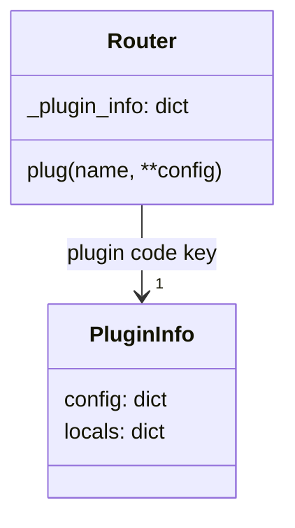

# Genro Routes Architecture (current state)

This document is the source of truth for how routing, hierarchy, and plugins work after the recent refactors (no `describe`, single plugin store on routers). Diagrams use Mermaid.

## Router and hierarchy

```mermaid
graph TD
  RC[RoutingClass instance]
  Router[Router (per instance)]
  ChildRC[Child RoutingClass]
  ChildRouter[Child Router]

  RC -->|attribute| Router
  RC -->|attribute| ChildRC
  ChildRC -->|attribute| ChildRouter
  Router -->|attach_instance(name/mapping)| ChildRouter
  Router -->|nodes| M[Nodes tree]
```

- Hierarchies are only via `attach_instance`/`detach_instance` (instance-to-instance).
- Branch routers (`branch=True`) exist but do not auto-discover handlers.
- `default_entry` (default: `"index"`) specifies which handler to use for catch-all routing with `partial=True`.
- Introspection: `nodes()` is the sole API; it returns router/instance, handlers (with metadata, doc, signature, plugins, params), children, and `plugin_info`.

## Plugin store

Single authoritative store per router: `router._plugin_info` (exposed via `nodes`).



Shape (reserved key `_all_` for router level; each block has `config` + `locals`):

```
plugin_info
└── "<plugin_code>"
    ├── _all_
    │   ├── config   # router-level defaults
    │   └── locals   # runtime plugin-level
    ├── entry_name_1
    │   ├── config   # override per entry
    │   └── locals   # runtime per entry
    └── entry_name_2
        ├── config
        └── locals
```

### Plugin lifecycle
- `plug("name", **config)`:
  - instantiates plugin via registered class;
  - calls `configure(**config)` which is validated by Pydantic;
  - binds plugin to the router;
  - seeds `plugin_info[name].config` from the provided config.
- Inheritance (`_on_attached_to_parent`): see [Plugin Inheritance](#plugin-inheritance) below.
- Detach of instances leaves plugin store on surviving routers untouched.

## Plugin Inheritance

When a child router is attached to a parent via `attach_instance()`, plugins may be inherited.
The inheritance behavior is **delegated to the plugin** via hooks, allowing each plugin to
decide how to handle parent-child relationships.

### Inheritance Rules (Default Behavior)

1. **Child does NOT have the plugin** → plugin is inherited from parent:
   - A new plugin instance is created on the child (cloned from parent's plugin class)
   - Plugin's `on_attached_to_parent(parent_plugin)` is called
   - Default behavior: copy parent's `_all_` config to child
   - `on_decore` is applied to all child entries

2. **Child already HAS the plugin** → parent does NOT interfere:
   - Child keeps its own plugin instance and configuration
   - No config is copied from parent
   - The child made an explicit choice by having the plugin

### Plugin Hooks for Inheritance

#### `on_attached_to_parent(parent_plugin)`

Called when a child router is attached to a parent that has this plugin.
The child plugin can decide how to handle the parent's configuration.

```python
def on_attached_to_parent(self, parent_plugin: BasePlugin) -> None:
    """Handle attachment to a parent router with this plugin.

    Default behavior: copy parent's _all_ config to child's _all_ config,
    preserving any entry-specific config the child already has.

    Override to customize inheritance behavior (e.g., AuthPlugin does
    union of tags instead of replacement).
    """
```

**Default implementation:**

- Copies parent's `_all_` config to child's `_all_` config
- Preserves child's entry-specific configurations (set via decorators)
- Does NOT overwrite child's `_all_` if child already configured it

#### `on_parent_config_changed(old_config, new_config)`

Called when the parent router modifies its plugin configuration after attachment.
The child plugin can decide whether to follow the change.

```python
def on_parent_config_changed(
    self,
    old_config: dict[str, Any],
    new_config: dict[str, Any]
) -> None:
    """Handle parent config change notification.

    Default behavior:
    - If child's config equals old_config (was aligned) → update to new_config
    - If child's config differs from old_config (was customized) → ignore change

    This preserves explicit child customizations while keeping "default"
    children in sync with parent changes.
    """
```

**Default implementation:**

- Compares child's current `_all_` config with `old_config`
- If equal (child was following parent) → update to `new_config`
- If different (child made own choices) → ignore the change

### Plugin API

- `BasePlugin` requires `plugin_code` and `plugin_description` class attributes.
- `configure(**config)` method defines accepted parameters (validated by Pydantic).
  - Use `_target` parameter to target specific entries: `configure(_target="handler_name", ...)`
  - Use `_target="_all_"` (default) for router-level config
- `configuration(method_name=None)` method returns merged config (base + per-handler override).
- Plugins should read config at call time (no baked-in closures) so live updates apply without rebuild.

### Plugin Inheritance Behavior

By default, `BasePlugin.on_attached_to_parent()` copies parent's `_all_` config to child
if the child only has default config (`{"enabled": True}`). This means:

- **LoggingPlugin, PydanticPlugin, OpenAPIPlugin**: Inherit config from parent by default
- **AuthPlugin, EnvPlugin**: Also inherit by default (they don't override `on_attached_to_parent`)

Note: Rule-based plugins like AuthPlugin and EnvPlugin inherit the plugin instance,
but each entry defines its own rule via decorators (`auth_rule`, `env_requires`).

## Introspection data (`nodes`)

```mermaid
graph LR
  R[Router] --> H[handlers]
  R --> C[children]
  R --> P[plugin_info]
  H --> E1[entry -> {callable, metadata, doc, signature, return_type, plugins, parameters, metadata_keys, extras}]
  C --> Rchild[child router ...]
```

- Filters (e.g., `tags` via AuthPlugin) apply to handlers and children; empty children pruned only when filters are active.
- `plugin_info` is included for routers; entries can mirror plugin info if desired, but the authoritative store is on the router.

## Admin/CLI/UI implications
- You can render a full tree (routers → children → handlers) with plugin config shown from `plugin_info`.
- Updates can target router-level or per-entry config and take effect immediately if plugins read config live.
- Locals are for plugin-owned runtime data; treat them as non-config state.
