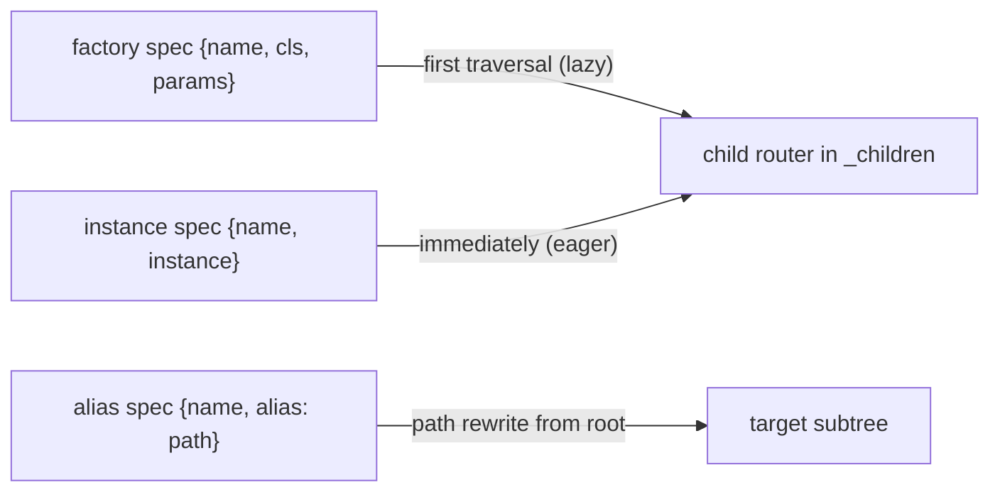
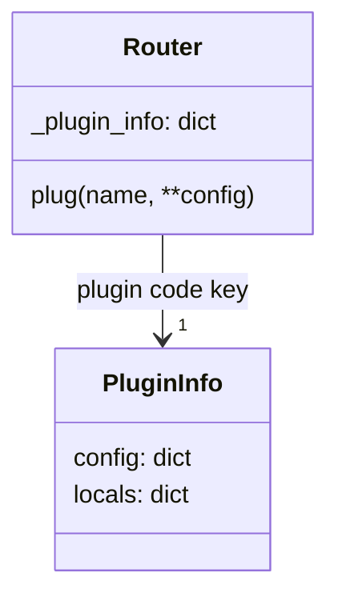
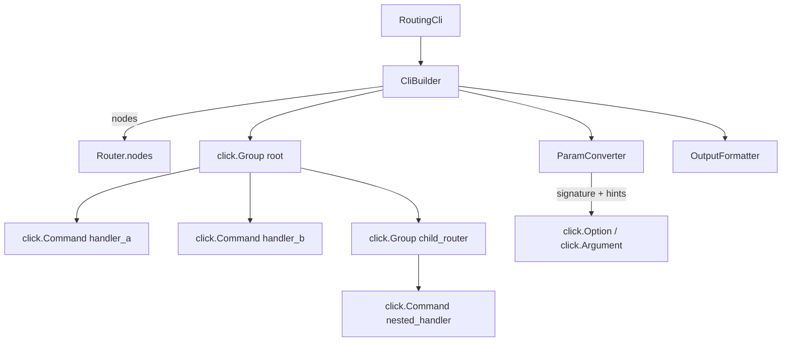

# Genro Routes Architecture (current state)

This document is the source of truth for how routing, hierarchy, and plugins work after the recent refactors (no `describe`, single plugin store on routers). Diagrams use Mermaid.

## Router and hierarchy

```mermaid
graph TD
  RC[RoutingClass instance]
  Router[Router (route property, one per instance)]
  ChildRC[Child RoutingClass]
  ChildRouter[Child Router]

  RC -->|route property| Router
  RC -->|attribute| ChildRC
  ChildRC -->|route property| ChildRouter
  RC -->|add_branches name+instance| ChildRC
  Router -->|include(child.route, name)| ChildRouter
  Router -->|nodes| M[Nodes tree]
```

- Every `RoutingClass` owns exactly one `Router`, created lazily on first access of the read-only `route` property. User code never instantiates `Router` directly; router options (`description`, `prefix`, `default_entry`) are set on `self.route` in `__init__`.
- Hierarchies are built via `add_branches` (method on `RoutingClass`): the instance form `{"name": alias, "instance": child}` links `child.route` into the parent's router under the alias eagerly, the factory form `{"name": alias, "cls": Child}` does so lazily at first traversal. Children are torn down via `detach_instance` (method on `Router`). See Branches below.
- `Section` (an empty `RoutingClass`) provides pure grouping nodes without handlers: `svc.add_branches({"name": "admin", "instance": Section("Admin area")})`.
- `default_entry` (default: `"index"`) specifies which handler to use for catch-all routing (best-match resolution).
- Introspection: `nodes()` is the sole API; it returns router/instance, handlers (with metadata, doc, signature, plugins, params), children, and `plugin_info`.

## Branches (declarative subtrees: factory, instance, alias)

`add_branches` is the single entry point for declaring a child subtree. Each
spec is one of three mutually exclusive forms (`cls` / `instance` / `alias`
cannot coexist). A **factory** spec is a self-describing subtree materialized
on demand: it lives in `router._branches` until built, then moves to
`router._children`. An **instance** spec attaches an already-built child
directly. Timing is derived from the form, not from a flag:


```mermaid
graph LR
  Factory["factory spec {name, cls, params}"] -->|"first traversal (lazy)"| Child["child router in _children"]
  Instance["instance spec {name, instance}"] -->|"immediately (eager)"| Child
  Alias["alias spec {name, alias: path}"] -->|"path rewrite from root"| Target["target subtree"]
```

- `add_branches(spec | list | generator)` accepts all three forms. A factory
  spec is stored — nothing is constructed at declaration; an instance spec is
  linked as a child at once. `remove_branch(name)` drops a spec (detaching the
  child if already materialized). The `branches` property lists declared
  factory specs not yet built; instances (already children) do not appear.
- **Factory** (lazy): materialized at the first path traversal through their
  segment (`_find_candidate_node` / `router_at_path`). Materialization (single
  point): construct `cls(**params)`, wire `_routing_parent`, `include()` the
  child router (triggering plugin inheritance), then drop the spec. The spec is
  popped only after a successful build: a failing constructor is repeatable,
  never silently lost.
- **Instance** (eager): the caller built the instance, so it is wired
  immediately at declaration — `_routing_parent` set, child `include()`d,
  plugin inheritance applied. `params` is rejected with an instance
  (`ValueError`); the instance must be a `RoutingClass` (`TypeError`); an
  instance already bound to another parent raises `ValueError`.
- **Alias** specs are transparent symlinks by absolute path from the tree root:
  navigation rewrites the path and resolves from the root, so the target's
  whole subtree is served with the target's plugins. Cycle-guarded
  (`ValueError`); broken targets resolve to `not_found`. A node reached through
  an alias reports the target's path (realpath semantics).
- **Introspection never builds**: `nodes()` shows lazy factory branches with
  their class-declared `@route` leaves (scanned from the class MRO, no
  instance) and aliases as unresolved markers. `nodes(_eager=True)` expands
  everything; `nodes(basepath=...)` opens one subtree. `node("@endpoint_id")`
  skips non-traversed factory branches.

## Plugin store

Single authoritative store per router: `router._plugin_info` (exposed via `nodes`).


```mermaid
classDiagram
  class Router {
    _plugin_info: dict
    plug(name, **config)
  }
  class PluginInfo {
    config: dict
    locals: dict
  }
  Router --> "1" PluginInfo : plugin code key
```

Shape (reserved key `_all_` for router level; each block has `config` + `locals`):

```
plugin_info
└── "<plugin_code>"
    ├── _all_
    │   ├── config   # router-level defaults
    │   └── locals   # runtime plugin-level
    ├── entry_name_1
    │   ├── config   # override per entry
    │   └── locals   # runtime per entry
    └── entry_name_2
        ├── config
        └── locals
```

### Plugin lifecycle
- `plug("name", **config)`:
  - instantiates plugin via registered class;
  - calls `configure(**config)` which is validated by Pydantic;
  - binds plugin to the router;
  - seeds `plugin_info[name].config` from the provided config.
- Inheritance (`_on_attached_to_parent`): see [Plugin Inheritance](#plugin-inheritance) below.
- Detach of instances leaves plugin store on surviving routers untouched.

## Plugin Inheritance

When a child is attached to a parent via `add_branches` (on `RoutingClass`) — at declaration for an instance spec, at first traversal for a factory spec — plugins may be inherited.
The inheritance behavior is **delegated to the plugin** via hooks, allowing each plugin to
decide how to handle parent-child relationships.

### Inheritance Rules (Default Behavior)

1. **Child does NOT have the plugin** → plugin is inherited from parent:
   - A new plugin instance is created on the child (cloned from parent's plugin class)
   - Plugin's `on_attached_to_parent(parent_plugin)` is called
   - Default behavior: copy parent's `_all_` config to child
   - `on_decore` is applied to all child entries

2. **Child already HAS the plugin** → parent does NOT interfere:
   - Child keeps its own plugin instance and configuration
   - No config is copied from parent
   - The child made an explicit choice by having the plugin

### Plugin Hooks for Inheritance

#### `on_attached_to_parent(parent_plugin)`

Called when a child router is attached to a parent that has this plugin.
The child plugin can decide how to handle the parent's configuration.

```python
def on_attached_to_parent(self, parent_plugin: BasePlugin) -> None:
    """Handle attachment to a parent router with this plugin.

    Default behavior: copy parent's _all_ config to child's _all_ config,
    preserving any entry-specific config the child already has.

    Override to customize inheritance behavior (e.g., AuthPlugin does
    union of tags instead of replacement).
    """
```

**Default implementation:**

- Copies parent's `_all_` config to child's `_all_` config
- Preserves child's entry-specific configurations (set via decorators)
- Does NOT overwrite child's `_all_` if child already configured it

#### `on_parent_config_changed(old_config, new_config)`

Called when the parent router modifies its plugin configuration after attachment.
The child plugin can decide whether to follow the change.

```python
def on_parent_config_changed(
    self,
    old_config: dict[str, Any],
    new_config: dict[str, Any]
) -> None:
    """Handle parent config change notification.

    Default behavior:
    - If child's config equals old_config (was aligned) → update to new_config
    - If child's config differs from old_config (was customized) → ignore change

    This preserves explicit child customizations while keeping "default"
    children in sync with parent changes.
    """
```

**Default implementation:**

- Compares child's current `_all_` config with `old_config`
- If equal (child was following parent) → update to `new_config`
- If different (child made own choices) → ignore the change

### Plugin API

- `BasePlugin` requires `plugin_code` and `plugin_description` class attributes.
- `configure(**config)` method defines accepted parameters (validated by Pydantic).
  - Use `_target` parameter to target specific entries: `configure(_target="handler_name", ...)`
  - Use `_target="_all_"` (default) for router-level config
- `configuration(method_name=None)` method returns merged config (base + per-handler override).
- Plugins should read config at call time (no baked-in closures) so live updates apply without rebuild.

### Plugin Inheritance Behavior

By default, `BasePlugin.on_attached_to_parent()` copies parent's `_all_` config to child
if the child only has default config (`{"enabled": True}`). This means:

- **LoggingPlugin, PydanticPlugin, ChannelPlugin**: Inherit config from parent by default
- **AuthPlugin, EnvPlugin**: Also inherit by default (they don't override `on_attached_to_parent`)

Note: Rule-based plugins like AuthPlugin and EnvPlugin inherit the plugin instance,
but each entry defines its own rule via decorators (`auth_rule`, `env_requires`).

## Introspection data (`nodes`)

```mermaid
graph LR
  R[Router] --> H[handlers]
  R --> C[children]
  R --> P[plugin_info]
  H --> E1[entry -> {callable, metadata, doc, signature, return_type, response_schema, plugins, parameters, metadata_keys, extras}]
  C --> Rchild[child router ...]
```

- Filters (e.g., `tags` via AuthPlugin) apply to handlers and children; empty children pruned only when filters are active.
- `plugin_info` is included for routers; entries can mirror plugin info if desired, but the authoritative store is on the router.

## Admin/CLI/UI implications

- You can render a full tree (routers → children → handlers) with plugin config shown from `plugin_info`.
- Updates can target router-level or per-entry config and take effect immediately if plugins read config live.
- Locals are for plugin-owned runtime data; treat them as non-config state.

## CLI transport adapter

The `cli/` package is a built-in transport adapter that generates a click command tree from router introspection.


```mermaid
graph TD
  RC[RoutingCli] --> CB[CliBuilder]
  CB -->|nodes| R[Router.nodes]
  CB --> G[click.Group root]
  G --> C1[click.Command handler_a]
  G --> C2[click.Command handler_b]
  G --> SG[click.Group child_router]
  SG --> C3[click.Command nested_handler]
  CB --> PC[ParamConverter]
  PC -->|signature + hints| CP[click.Option / click.Argument]
  CB --> OF[OutputFormatter]
```

### Data flow

1. `RoutingCli(target)` — accepts class or instance.
2. `CliBuilder.build()` — reads `instance.route.nodes()`:
   - Entries become root commands.
   - Child routers (attached instances) become nested `click.Group`s.
3. For each entry, `ParamConverter.to_click_params(handler)` maps `inspect.signature` + `get_type_hints` to click parameters.
4. The command callback invokes the handler and pipes the result through `OutputFormatter`.

### Key design decisions

- **Not a plugin** — the CLI invokes handlers; it does not alter their behavior.
- **Optional dependency** — `click` is required only when `genro_routes.cli` is imported (`pip install genro-routes[cli]`).
- **Name normalization** — Python `snake_case` names are converted to `kebab-case` for CLI convention.
- **Enum roundtrip** — `click.Choice` returns strings; the callback converts them back to enum members before invoking the handler.
- **Async support** — coroutine handlers are detected via `inspect.iscoroutinefunction` and invoked with `asyncio.run()`.
