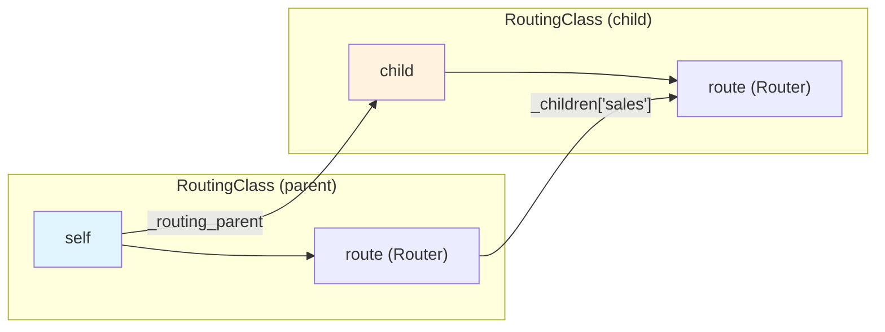
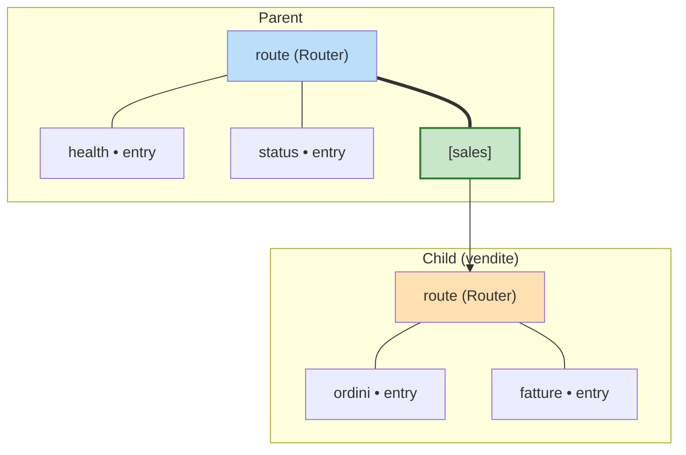
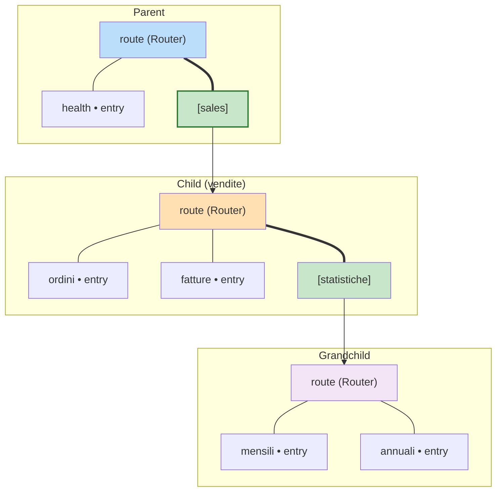
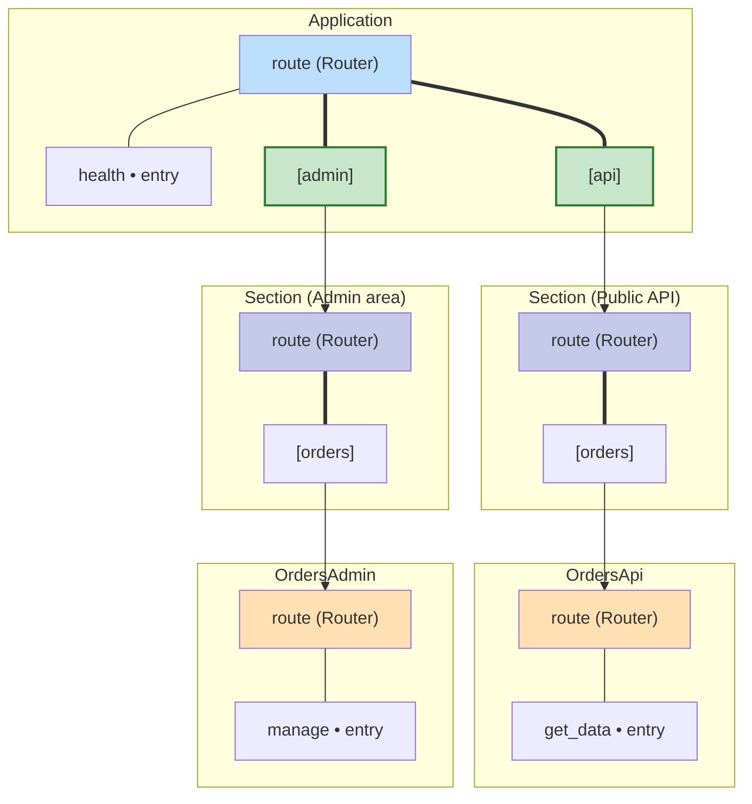
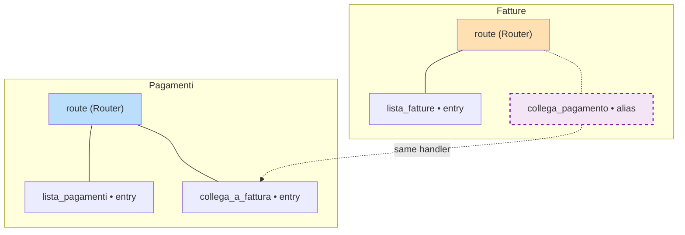
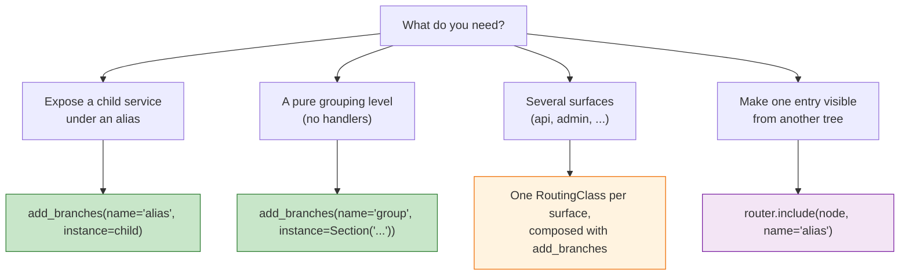

# Instance Attachment Visual Guide

How to connect RoutingClass instances into hierarchies with the instance form
of `add_branches`.

## Core Concept

`add_branches` lives on **RoutingClass** (not on Router). Every RoutingClass
owns exactly one router (`self.route`). Its **instance form**
(`{"name": alias, "instance": child}`) attaches an already-built child eagerly
and does two things:

1. Sets the parent-child relationship (`child._routing_parent = self`)
2. Links the child's router into the parent's router (`parent.route._children[alias] = child.route`, via `include()`)



---

## Scenario 1: Attaching a Child

Parent and child each own one router. The child's router is linked under the alias.



**Syntax:**

```python
self.add_branches({"name": "sales", "instance": vendite})
```

**Access paths:**

```python
self.route.node("health")()         # local entry
self.route.node("sales/ordini")()   # child entry
self.route.node("sales/fatture")()  # child entry
```

**Rule:** the `"name"` key is the alias in the parent's router. Every
RoutingClass has exactly one router, so there is nothing else to map.

---

## Scenario 2: Child with Its Own Children

An attached child brings its whole sub-tree along.



**Syntax:**

```python
vendite.add_branches({"name": "statistiche", "instance": statistiche})
self.add_branches({"name": "sales", "instance": vendite})
```

**Access paths:**

```python
self.route.node("sales/ordini")()              # child entry
self.route.node("sales/statistiche/mensili")() # grandchild entry
```

---

## Scenario 3: Multiple Surfaces — Composition

One class exposes one router. A service that needs several surfaces (public API,
admin, ...) is split into **one class per surface**, composed under grouping
nodes. `Section` provides an empty grouping node without a dedicated class.



**Syntax:**

```python
from genro_routes import Section

api = Section("Public API")
admin = Section("Admin area")
self.add_branches({"name": "api", "instance": api})
self.add_branches({"name": "admin", "instance": admin})
api.add_branches({"name": "orders", "instance": OrdersApi()})
admin.add_branches({"name": "orders", "instance": OrdersAdmin()})
```

**Access paths:**

```python
self.route.node("api/orders/get_data")()   # public surface
self.route.node("admin/orders/manage")()   # admin surface
```

> **Note:** earlier versions supported multiple routers per class with a
> `router_*` cross-mapping DSL. That feature was removed: composition (one
> class per surface, `Section` for grouping) covers the same use cases with a
> single calling style.

---

## Syntax Reference

### `add_branches({"name": alias, "instance": child})`

```python
self.add_branches({"name": "alias", "instance": child})
```

- The child's router is linked under `alias` in the parent's router (eager: at the call)
- Sets `child._routing_parent = self`
- `params` is not allowed together with `instance` (`ValueError`)
- `instance` must be a `RoutingClass` (`TypeError` otherwise)
- Raises `ValueError` on alias collision or if the child is already bound to another parent

### `include` (on Router — low level)

Direct router-to-router or entry-alias linking.

**Include a Router:**

```python
self._sys.route.include(swagger.route, name="swagger")
```

- Links the source router as a child of this router
- On the **primary** attachment (source has no parent yet) it sets
  `_routing_parent` on the source's owner and triggers plugin inheritance
- Subsequent includes of the same router are navigational shortcuts only

**Include a RouterNode (entry alias):**

```python
fatture.route.include(
    pagamenti.route.node("collega_a_fattura"),
    name="collega_pagamento",
)
```

- Creates an alias: same handler, visible from two paths
- No copy — the original MethodEntry is shared
- `name` is required for RouterNode sources

### `detach_instance` (on Router)

```python
self.route.detach_instance(child)
```

- Removes every alias of `child`'s router from this router's `_children`
- Clears `child._routing_parent`
- Stays on **Router**, not RoutingClass

---

## Scenario 4: Entry Alias

The same handler declared in one service, visible in another's tree.



**Syntax:**

```python
fatture.route.include(
    pagamenti.route.node("collega_a_fattura"),
    name="collega_pagamento",
)
```

**Access paths:**

```python
pagamenti.route.node("collega_a_fattura")(1, 2)   # original
fatture.route.node("collega_pagamento")(1, 2)     # alias — same handler
```

---

## Decision Guide



---

## Real-World Example

```python
from genro_routes import RoutingClass, route

class AuthService(RoutingClass):
    @route()
    def login(self, username: str, password: str):
        return {"token": "..."}

class UserService(RoutingClass):
    @route()
    def list_users(self):
        return ["alice", "bob"]

class Application(RoutingClass):
    def __init__(self):
        self.route.plug("logging")
        self.auth = AuthService()
        self.users = UserService()

        self.add_branches({"name": "auth", "instance": self.auth})
        self.add_branches({"name": "users", "instance": self.users})

app = Application()

app.route.node("auth/login")("alice", "secret")
app.route.node("users/list_users")()
```
