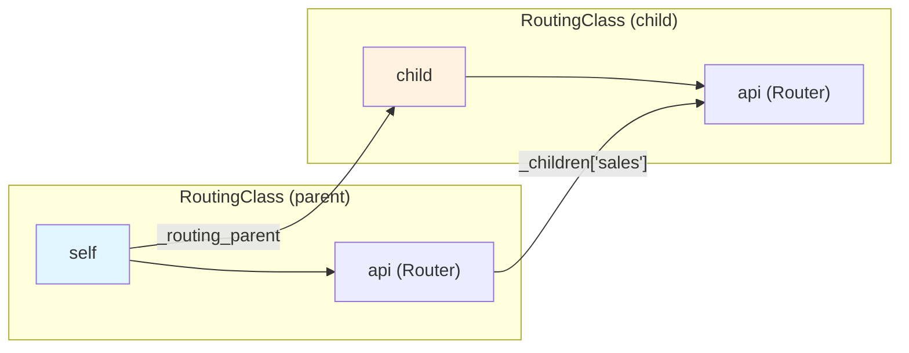
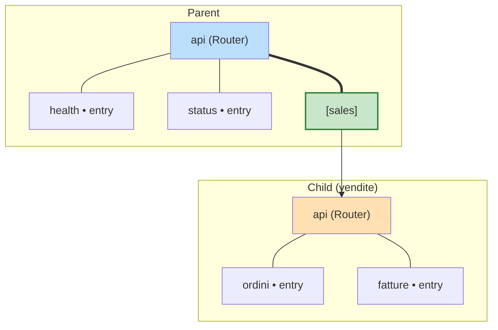
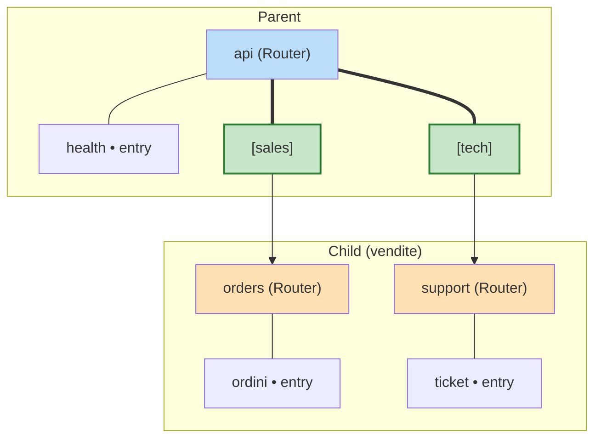
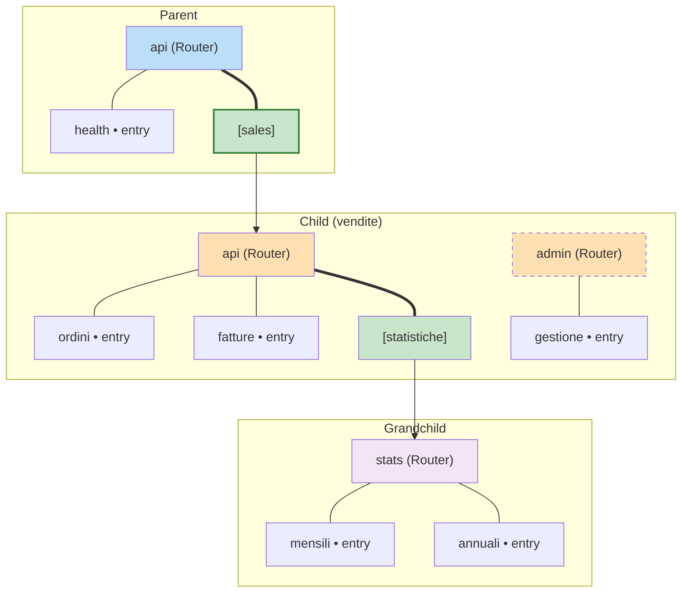
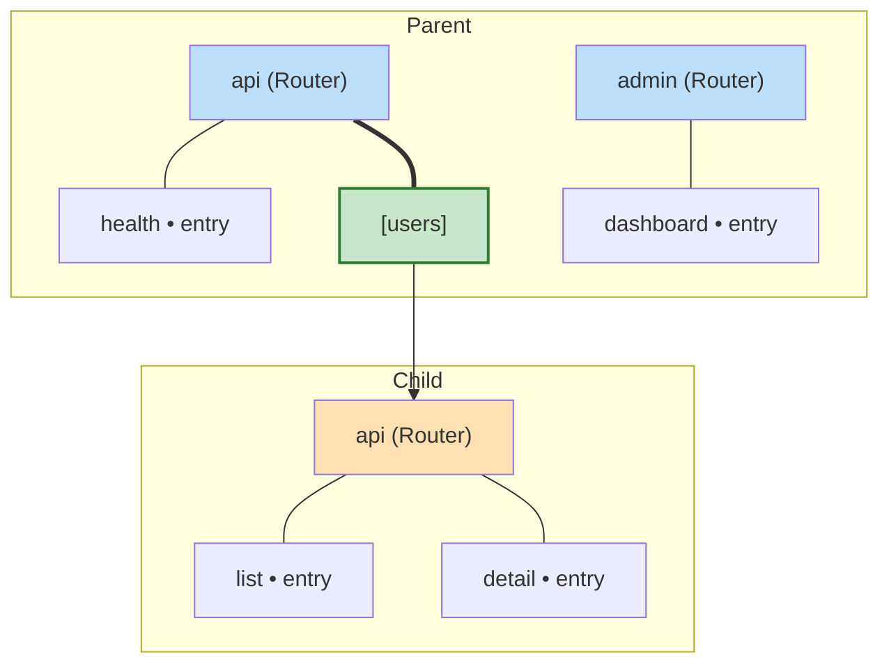
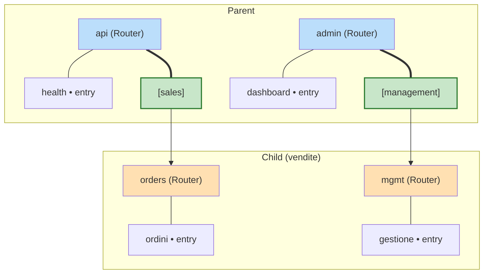
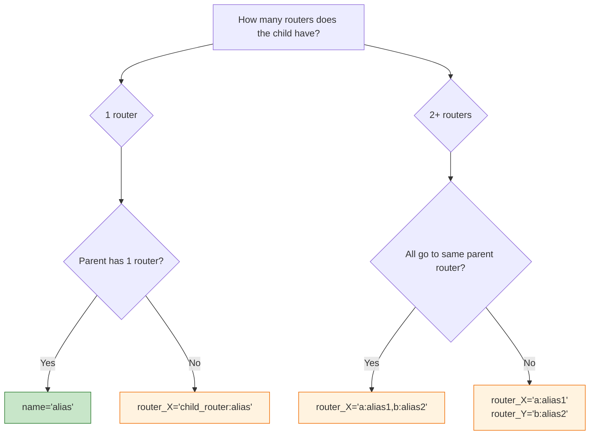

# attach_instance Visual Guide

How to connect RoutingClass instances into hierarchies.

## Core Concept

`attach_instance` lives on **RoutingClass** (not on Router). It does two things:

1. Sets the parent-child relationship (`child._routing_parent = self`)
2. Links child routers into parent routers (`parent_router._children[alias] = child_router`)



---

## Scenario 1: One-to-One

Parent has **1 router**, child has **1 router**.



**Syntax:**

```python
self.attach_instance(vendite, name="sales")
```

**Access paths:**

```python
self.api.node("health")()         # local entry
self.api.node("sales/ordini")()   # child entry
self.api.node("sales/fatture")()  # child entry
```

**Rule:** `name=` shortcut works only when child has exactly one router.

---

## Scenario 2: One parent router, two child routers — child "dissolves"

Child's routers are flattened into the parent's single router. The child instance does not appear as an intermediate node.



**Syntax:**

```python
self.attach_instance(vendite, router_api="orders:sales,support:tech")
```

**Format:** `router_<parent_router>="<child_router>:<alias>,<child_router>:<alias>"`

**Access paths:**

```python
self.api.node("sales/ordini")()   # from child.orders
self.api.node("tech/ticket")()    # from child.support
```

---

## Scenario 3: One parent router, two child routers — child "appears" with one router

Only one of the child's routers is linked. The child appears as a node in the hierarchy, and any sub-routers of the linked router come along.



**Syntax:**

```python
self.attach_instance(vendite, router_api="api:sales")
# Only vendite.api is linked. vendite.admin is NOT attached.
```

**Access paths:**

```python
self.api.node("sales/ordini")()              # child entry
self.api.node("sales/statistiche/mensili")() # grandchild entry
# self.api.node("???/gestione")  -- NOT accessible (admin not linked)
```

---

## Scenario 4: Two parent routers, one child router — parent chooses where



**Syntax:**

```python
self.attach_instance(child, router_api="api:users")
```

The kwarg `router_api` targets the parent's `api` router. The child could be linked to `admin` instead:

```python
self.attach_instance(child, router_admin="api:users")
```

**Note:** `name=` does NOT work here because the parent has multiple routers.

---

## Scenario 5: Two parent routers, two child routers — cross-mapping



**Syntax:**

```python
self.attach_instance(vendite,
    router_api="orders:sales",
    router_admin="mgmt:management",
)
```

Each `router_<parent_router>` kwarg specifies which child routers go into which parent router.

**Access paths:**

```python
self.api.node("sales/ordini")()           # parent.api -> child.orders
self.admin.node("management/gestione")()  # parent.admin -> child.mgmt
```

---

## Syntax Reference

### `name=` shortcut (1:1)

```python
self.attach_instance(child, name="alias")
```

- Child must have **exactly one** router
- Parent must have **exactly one** router
- The child's single router is linked under `alias` in the parent's single router

### `router_*` kwargs (any mapping)

```python
self.attach_instance(child,
    router_<parent_router>="<child_router>:<alias>,<child_router>:<alias>",
    router_<parent_router>="<child_router>:<alias>",
)
```

- Works with any number of parent/child routers
- Multiple child routers can be linked to the same parent router (comma-separated)
- Different child routers can go to different parent routers (separate kwargs)

### Attach only (no routing)

```python
self.attach_instance(child)
```

- Sets `child._routing_parent = self` only
- No routers are linked
- Useful when you plan to link routers later or only need the parent chain for `ctx` propagation

### `detach_instance` (on Router)

```python
self.api.detach_instance(child)
```

- Removes all of `child`'s routers from this router's `_children`
- Clears `child._routing_parent`
- Stays on **Router**, not RoutingClass

---

## Decision Guide



---

## Real-World Example

```python
from genro_routes import RoutingClass, Router, route

class AuthService(RoutingClass):
    def __init__(self):
        self.api = Router(self, name="api")

    @route("api")
    def login(self, username: str, password: str):
        return {"token": "..."}

class UserService(RoutingClass):
    def __init__(self):
        self.api = Router(self, name="api")

    @route("api")
    def list_users(self):
        return ["alice", "bob"]

class Application(RoutingClass):
    def __init__(self):
        self.api = Router(self, name="api").plug("logging")
        self.auth = AuthService()
        self.users = UserService()

        self.attach_instance(self.auth, name="auth")
        self.attach_instance(self.users, name="users")

app = Application()

app.api.node("auth/login")("alice", "secret")
app.api.node("users/list_users")()
```
